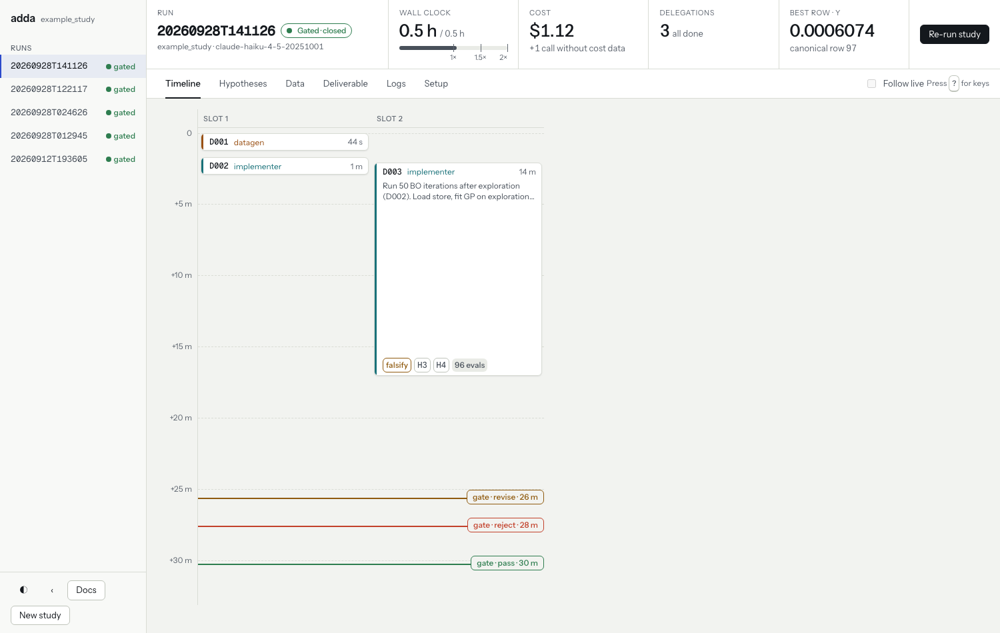
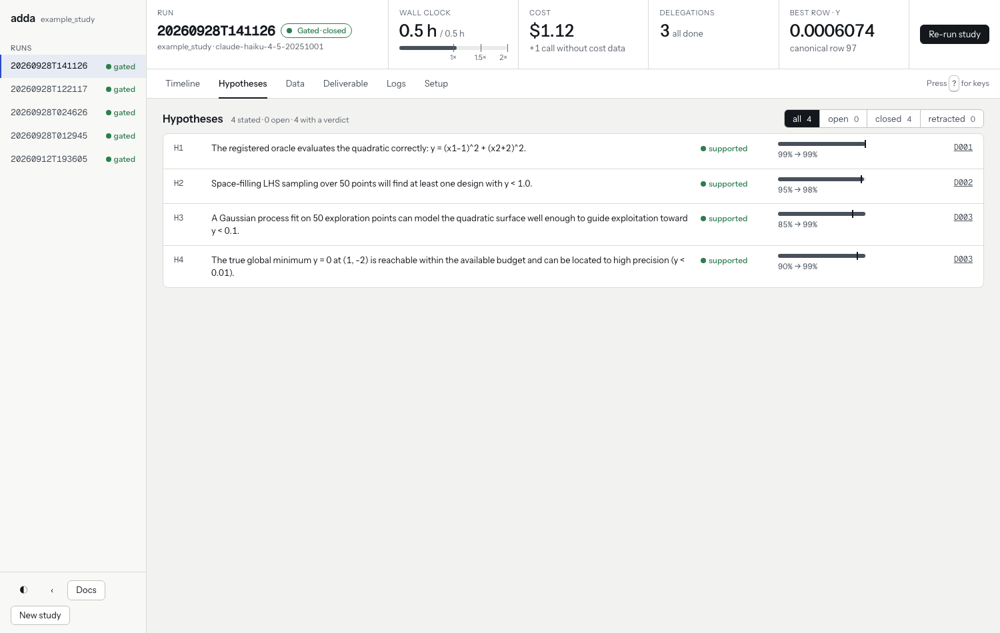
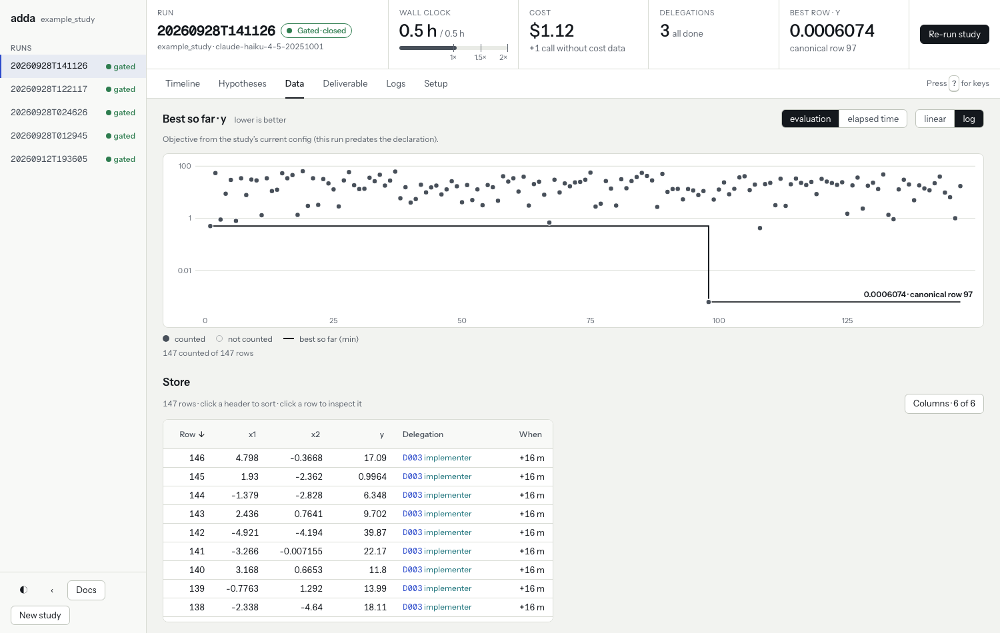
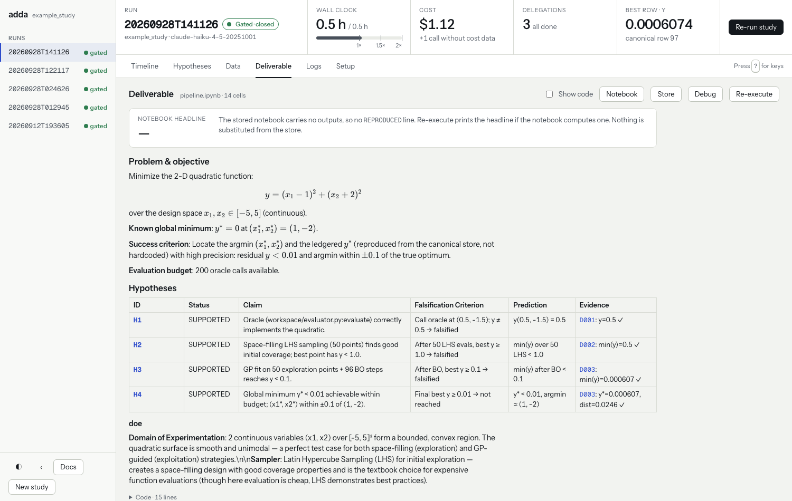

# Your first run in the viewer

The viewer is a web page that shows a run as it works and after it ends. This
page walks through a finished run of the `example_study`, a two-variable
quadratic with its minimum at (1, −2). The run used `claude-haiku-4-5-20251001`,
took half an hour, and cost $1.12.

## Open the viewer

```bash
pip install "adda[viewer]"
python -m adda.viewer studies/example_study
```

Open the `http://127.0.0.1:8765/session?token=…` URL that the command prints.
The viewer lists every run in the study's `runs/` directory on the left. Pick
one.

## Read the header

The header answers four questions about the selected run:

- How long has it run, compared with its budget (**Wall clock**)?
- How much has it cost (**Cost**)?
- How many delegations are done or running (**Delegations**)?
- What is the best counted result so far (**Best row**)?

The green badge beside the run name says the run closed as **Gated**: the
reproduction gate accepted the deliverable. Other runs show running, stopped,
halted, or crashed.

## Find who did what in the Timeline



Each card is one delegation. Here the data generator checked the oracle
(`D001`), an implementer sampled 50 points (`D002`), and another implementer
delegation ran Bayesian optimization (`D003`) for 14 minutes. The three marks at the
bottom are the acceptance reviews of the deliverable: one asked for a
revision, one rejected, and the last passed.

## Check what the run believed in Hypotheses



Every claim the run relies on is a hypothesis with a status and a confidence
that moves as evidence arrives. Each row links to the delegation that tested
it. See [How a run is kept honest](how-a-run-is-kept-honest.md) for the rules
a hypothesis must meet before the run marks it supported.

## Check the evidence in Data



The chart plots every evaluation the run paid for. The step line is the best
value so far. In this run the best value dropped at evaluation 97, from below
1 to 0.0006. The table below lists the stored rows, and each row names the
delegation that produced it.

## Read the answer in Deliverable



The deliverable is `pipeline.ipynb`, rendered in the page. The **Re-execute**
button runs the notebook again.

## Go further

The **Logs** and **Setup** views, and the controls that start, stop, and steer
a run, are described in [Watch and steer a run](watch-and-steer-a-run.md).
